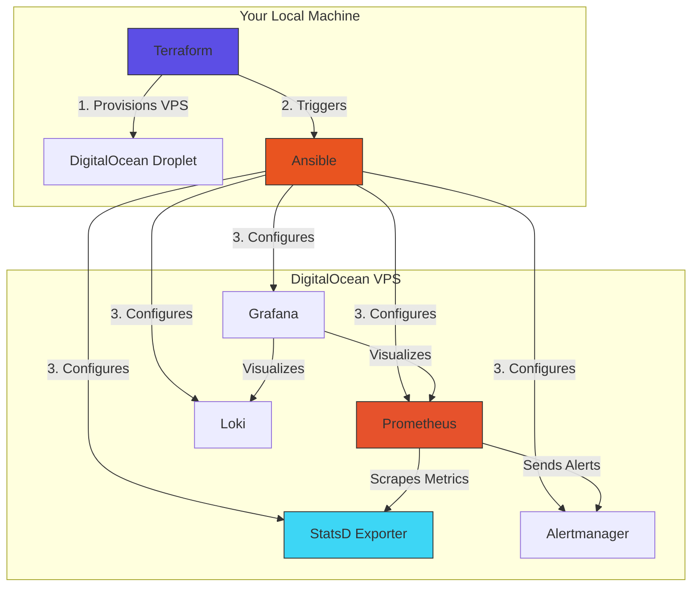

#  Monitory-Stack Deployment for DigitalOcean VPS  
**End-to-End Automation with Terraform + Ansible | Observability Stack**  

A fully automated deployment where:  
- **Terraform** provisions the VPS **and triggers Ansible via provisioners**  
- **Ansible** configures Prometheus, Grafana, Loki, Alertmanager, and StatsD Exporter  

---

## 📋 Table of Contents  
- [Repository Structure](#-repository-structure)  
- [Features](#-features)  
- [Architecture](#-architecture)  
- [Technologies Used](#-technologies-used)  
- [Prerequisites](#-prerequisites)  
- [Automated Deployment](#-automated-deployment)  
- [Accessing Services](#-accessing-services)  
- [Troubleshooting](#-troubleshooting)  
- [Contributing](#-contributing)  
- [License](#-license)  

---

## 📂 Repository Structure  
```plaintext
Monitory-Stack_DigitalOcean_VPS/
├── ansible/                   # Ansible configuration
│   ├── roles/
│   │   ├── prometheus/        # Prometheus installation/config
│   │   ├── grafana/           # Grafana setup
│   │   ├── loki/              # Loki log aggregation
│   │   ├── alertmanager/      # Alertmanager configuration
│   │   └── statsd_exporter/   # StatsD Exporter setup
│   ├── inventory.ini          # Auto-generated by Terraform
│   └── site.yml               # Main playbook (triggered by Terraform)
│
├── terraform/                 # Infrastructure as Code
│   ├── main.tf                # DigitalOcean provider + VPS definition
│   ├── outputs.tf             # Outputs VPS IP
│   ├── terraform.tfvars       # API token + SSH key (gitignored)
│   └── variables.tf           # Variable declarations
│
├── monitoring-configs/        # Service configurations
│   ├── prometheus/            # Prometheus alert rules + scrape configs
│   ├── loki/                  # Loki config files
│   └── alertmanager/          # Alertmanager routing rules
│
└── README.md                  # This documentation
```

---

## 🚀 Features  
- **Hands-Off Deployment:**  
  - Terraform’s `local-exec` provisioner **auto-triggers Ansible** – no manual steps.

- **Full Observability Stack:**  
This monitoring stack provides end-to-end observability with metrics, logs, and alerts:
- **Metrics Collection:** Prometheus scrapes metrics from targets, StatsD Exporter converts StatsD format metrics
- **Log Management:** Loki collects and indexes logs
- **Visualization:** Grafana provides dashboards for metrics and logs
- **Alerting:** Alertmanager handles alert notification and routing.
- **Secure Defaults:**  
  - UFW firewall restricts access to essential ports (`3000`, `9090`, etc.).  

---

## 🏗️ Architecture  


---

## 🛠️ Technologies Used  
| Component         | Technology      |  
|-------------------|-----------------|  
| **Infrastructure**| Terraform       |  
| **Configuration** | Ansible         |  
| **Monitoring**    | Prometheus      |  
| **Logging**       | Loki            |  
| **Alerting**      | Alertmanager    |  
| **Metrics**       | StatsD Exporter |  

---

## ⚙️ Automated Deployment  
### 1. Clone and Configure  
```bash  
git clone https://github.com/fortis-07/Monitory-Stack_DigitalOcean_VPS.git  
cd Monitory-Stack_DigitalOcean_VPS/terraform  
echo 'do_token = "YOUR_DIGITALOCEAN_API_TOKEN"' > terraform.tfvars  
echo 'ssh_key_name = "YOUR_SSH_KEY_NAME"' >> terraform.tfvars  
```  

### 2. Deploy  
```bash  
terraform init  
terraform apply -auto-approve  # Provisions VPS + triggers Ansible  
```  

**What Happens Automatically:**  
1. Terraform creates the VPS and runs:  
   ```hcl  
   provisioner "local-exec" {  
     command = "ansible-playbook -i '${self.ipv4_address},' ../ansible/site.yml --user=root"  
   }  
   ```  
2. Ansible installs/configures all services (see [Repository Structure](#-repository-structure)).  

---

## 🌐 Accessing Services  
| Service          | URL                                  |  
|------------------|--------------------------------------|  
| **Grafana**      | `http://<vps-ip>:3000`              |  
| **Prometheus**   | `http://<vps-ip>:9090`              |  
| **Loki**         | `http://<vps-ip>:9080`              |  
| **Alertmanager** | `http://<vps-ip>:9093`              |  

**Grafana Setup:**  
1. Add data sources:  
   - Prometheus: `http://localhost:9090`  
   - Loki: `http://localhost:9080`  

---

## 🔧 Troubleshooting  
### **Terraform Errors**  
- **"Failed to trigger Ansible"**:  
  - Verify `ansible-playbook` is in your local `$PATH`.  
  - Check paths in `local-exec` (relative to `terraform/`).  

### **Service Issues**  
```bash  
ssh root@<vps-ip>  
journalctl -u prometheus -u statsd-exporter --no-pager  # Check logs  
```  

---

## 🤝 Contributing  
1. Fork the repo.  
2. Create a branch (`git checkout -b feature/your-feature`).  
3. Submit a PR.  

---

## 📜 License  
MIT © [fortis-07](https://github.com/fortis-07)  
```

---

### Key Additions:  
1. **Repository Structure Section**:  
   - Clear breakdown of directories and their purposes.  
   - Highlights Ansible roles and Terraform files.  
2. **Precise Path References**:  
   - Added context for `local-exec` paths (e.g., `../ansible/site.yml`).  
3. **Simplified Setup**:  
   - Combined clone + deploy steps into a streamlined flow.  

Let me know if you'd like to emphasize any other aspects!
